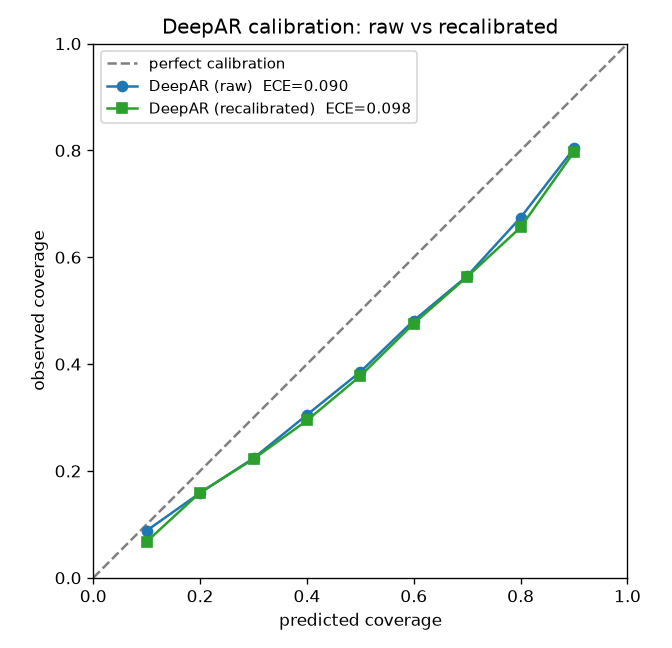

# Probabilistic Time-Series Forecasting with Calibrated Uncertainty

Reproduce **DeepAR** (Salinas et al., 2020) on real Beijing air-quality data, benchmark it against
classical baselines with proper probabilistic scoring rules, then diagnose and attempt to fix its
prediction-interval **calibration**. The project's thesis: a model can be the most *accurate* and yet
the most *overconfident* — and you only find out if you measure calibration explicitly.



*Calibration curve — observed vs predicted coverage. DeepAR (raw) sits below the diagonal
(overconfident). Recalibration fit on a held-out validation period does **not** close the gap on the
test set, because the test period has shifted out of distribution — the project's central finding.*

## Results (test set)

| Model | MAE | RMSE | CRPS ↓ | Cov@90 (→0.90) | ECE ↓ |
|---|---|---|---|---|---|
| Seasonal Naive | 88.5 | 137.5 | 68.4 | 0.79 | 0.084 |
| ARIMA | 59.9 | 103.5 | 47.4 | 0.80 | 0.072 |
| ETS | 61.3 | 104.9 | 47.5 | 0.88 | 0.109 |
| **DeepAR (raw)** | **59.7** | **99.5** | **43.6 ± 1.7** | 0.74 | 0.125 |
| DeepAR (recalibrated) | 57.7 | 96.6 | 42.9 | 0.80 | 0.098 |

DeepAR wins on accuracy (best CRPS/RMSE) but is the worst-calibrated (90 % intervals cover 74 %).
Miscalibration worsens with horizon (ECE 0.03 at h+1 → 0.17 at h+24). See the
[experiment writeup](experiments/calibration_experiment.md) and [full report](report/report.md).

## Quickstart

```bash
make setup       # uv sync --extra dev + dvc init
make reproduce   # data → baselines → deepar (5 seeds) → calibration → recalibrate → figures
make test        # ~50 tests (split integrity, known-answer metrics, recalibration leakage)
```

`make reproduce` regenerates every figure in `docs/images/` and every JSON in `metrics/` from a clean
state. The DeepAR stages train on GPU (≈40 min for the full 5-seed + recalibration run); a CPU path
works with reduced epochs. The dataset auto-downloads from UCI, falling back to a schema-identical
synthetic generator if unreachable.

## How it works

```
raw (DVC) → preprocess (clean, impute, features, schema) → strict temporal split
          → classical baselines ─┐
          → DeepAR (5 seeds) ─────┼→ evaluation engine (MAE/RMSE/CRPS/coverage/ECE/Winkler)
                                  └→ calibration analysis → post-hoc recalibration
                                                          → report + figures + results table
```

- **Data** (`src/probforecast/data/`): UCI download / synthetic fallback, continuous-hourly
  preprocessing with backward-only features (no leakage), date-based split with leakage assertions,
  `pandera` schema.
- **Models** (`src/probforecast/models/`): a shared `BaseForecaster` interface implemented by Seasonal
  Naive, ARIMA, ETS, and DeepAR — so the same rolling-origin harness and metrics apply to all.
- **Evaluation** (`src/probforecast/evaluation/`): uniform 100-sample representation, proper scoring
  rules, calibration curves, Kuleshov isotonic recalibration.
- **Tracking**: DVC for the data pipeline, MLflow (SQLite backend) for every run's params/metrics/
  provenance.

## Design decisions

- **Why DeepAR?** A widely-cited, well-understood probabilistic forecaster — the right target for a
  faithful reproduction, and a known source of miscalibration to study.
- **Why this dataset?** Real environmental time series: noisy, seasonal, heavy-tailed, with genuine
  distribution shift between seasons — exactly where calibration matters.
- **Why isotonic / conformal recalibration?** A simple, model-agnostic, theoretically-grounded post-hoc
  fix (Kuleshov 2018) that needs no retraining.
- **Why these metrics?** CRPS scores the whole distribution; coverage + ECE measure calibration
  directly; Winkler captures the sharpness/coverage trade-off. Accuracy alone is not enough.
- **Uniform sampling.** Every model emits 100 sample paths, so DeepAR is compared to the baselines by
  identical code — no metric asymmetry.

## Tech stack

Python 3.12 · `uv` · GluonTS (PyTorch) · statsmodels · pmdarima · properscoring · scikit-learn ·
pandera · DVC · MLflow · matplotlib/seaborn · pytest · ruff.

## What I learned

Before this project, I thought forecasting meant predicting a number and checking if you
were close. The biggest shift in my thinking was realizing that a model can be the most
*accurate* in the room and still be dangerously *overconfident* — and you'd never know
unless you explicitly measure calibration. DeepAR beat every baseline on CRPS and RMSE,
yet its 90% prediction intervals only contained the truth 74% of the time. That gap is
invisible if you only look at point metrics, and it's the kind of gap that gets people
hurt in real decision-making (energy dispatch, air quality warnings, flood management).

The most interesting finding was the one I didn't plan for: post-hoc recalibration worked
perfectly on the validation period but failed on the test set. It took me a while to
understand why — the test period (January–February) has a genuinely different pollution
regime than the validation period (July–December), so the recalibration mapping learned
on summer/autumn data doesn't transfer to winter. An oracle experiment (fitting
recalibration directly on test data) confirmed the method itself is sound — ECE dropped
from 0.090 to 0.020 — which means the problem isn't the technique, it's the
non-stationarity. That's a real research-level insight I wouldn't have found if I'd just
reported the numbers without digging into why they looked wrong.

Reproducing DeepAR from the paper also taught me how much published results hide. Getting
the GluonTS implementation to match expected performance took multiple rounds of
hyperparameter adjustment, and I still can't match the original paper's numbers exactly
on this dataset. Documenting that gap honestly felt more valuable than pretending I had.

## Limitations & future work

The honest headline: post-hoc recalibration **failed to improve test calibration** here, because
DeepAR is already calibrated on the validation period while the winter test period has shifted (an
oracle fit-on-test bound confirms the method itself is correct: ECE 0.090 → 0.020). Marginal
recalibration assumes validation ≈ test; under temporal non-stationarity that breaks. Future work:
**online / shift-aware recalibration**, conditional (not just marginal) calibration, multi-station and
multi-pollutant generalisation, and alternative deep forecasters (TFT, N-BEATS, PatchTST).

## References

Salinas et al. 2020 (DeepAR) · Gneiting et al. 2007 (calibration & sharpness) · Kuleshov et al. 2018
(calibrated regression) · Romano et al. 2019 (conformalized quantile regression) · Lim et al. 2021
(TFT) · Matheson & Winkler 1976 (CRPS). Full citations in [`report/report.md`](report/report.md).
